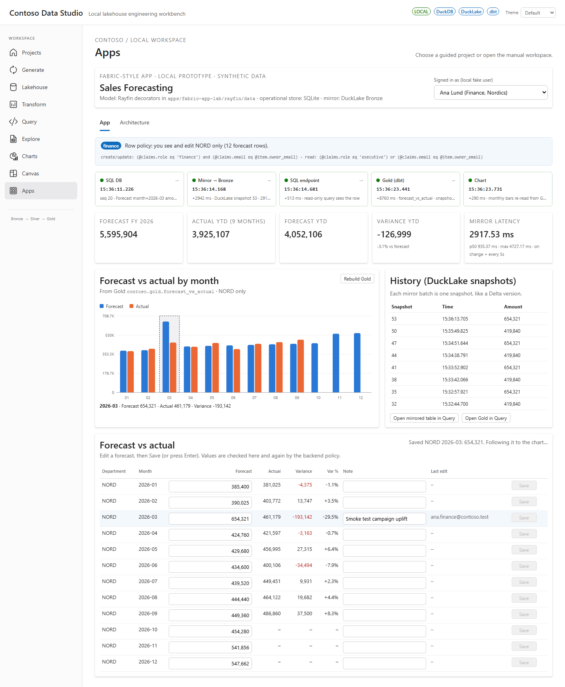
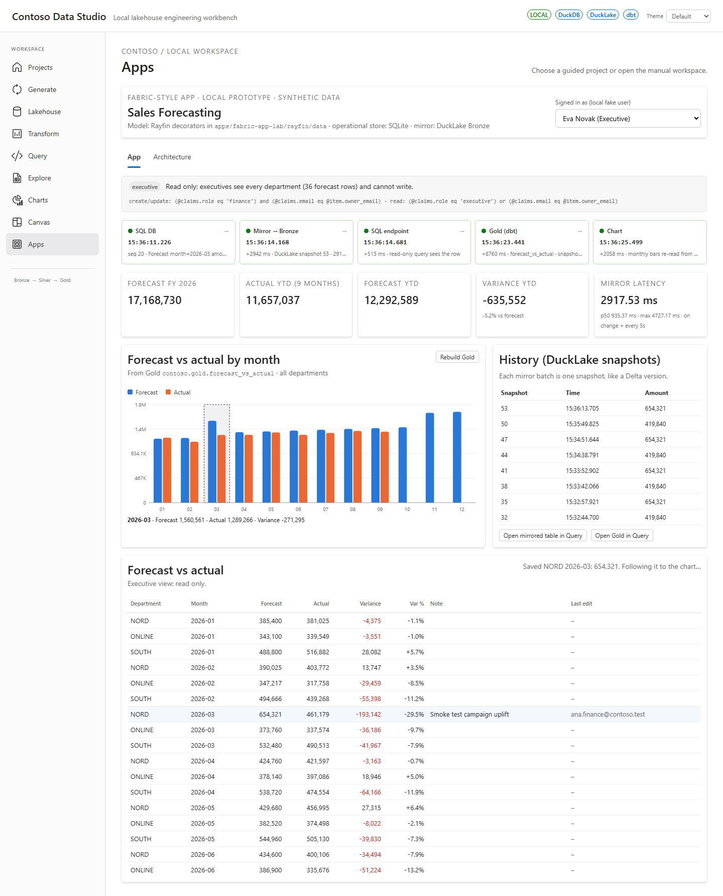
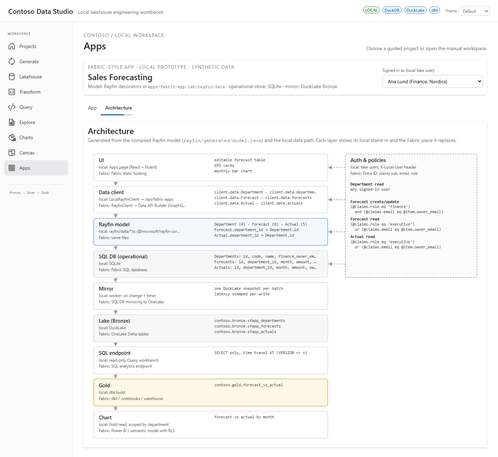

# Fabric-style apps lab (local)

A local way to prototype apps shaped like Microsoft Fabric Apps (Rayfin engine) on synthetic data,
then port them to a real Fabric App with real data and little rework. It is **not** a replacement for
Fabric Apps: no Entra ID, no hosting, no OneLake. No cloud calls, no sign-in. Decision record: [ADR-001](ADR-001.md).

Sample: **Sales Forecasting** (finance teams edit monthly forecasts, executives read everything).

```text
Web "Apps" page ──LocalRayfinClient──▶ /api/fabric-apps (policies on every call) ──▶ SQLite (operational "SQL DB")
                                                                                        │ mirror worker (on change + every 5 s)
SQL workbench / Gold endpoint ◀── DuckLake contoso.bronze.sfapp_* (OneLake stand-in, one snapshot per batch)
                                        │ dbt build forecast_vs_actual
                                        ▼
                               contoso.gold.forecast_vs_actual ──▶ KPI + monthly chart
```

## Run it

```bash
# model (only when entities change): compiles the Rayfin decorators offline
cd apps/fabric-app-lab && npm install && npm run export-model
# API + web as usual (see the main README), then open the "Apps" tab
```

Env knobs: `CONTOSO_FABRIC_MIRROR_INTERVAL` (seconds, default 5), `CONTOSO_FABRIC_GOLD_AUTO=0` to stop
rebuilding Gold after each mirror batch. `POST /api/fabric-apps/sales-forecasting/reset` reseeds the data.

Fake users (local only): Ana (finance, NORD), Ben (finance, SOUTH), Cleo (finance, ONLINE), Eva (executive).

## Local ↔ Fabric mapping

| Concern | Fabric App (Rayfin) | This lab | Same code? |
|---|---|---|---|
| Data model | `rayfin/data/*.ts` with `@microsoft/rayfin-core` decorators | `apps/fabric-app-lab/rayfin/data/*.ts`, same package (1.36.2) | **Yes** |
| Schema map | `rayfin/data/schema.ts` | same file | **Yes** |
| Keys and relations | uuid `id`, `{prop}_id` FKs, `@one`/`@many` | same, compiled by Rayfin's own analyzer | **Yes** |
| Permissions | `@authenticated(actions, { policy })` → DAB policies | same decorators; AST evaluated in `policy.py` | Model yes, engine local |
| Schema apply | `npx rayfin up db apply` (SQL DB) | `npm run export-model` → `model.json` → SQLite DDL | No |
| Operational DB | Fabric SQL database | SQLite `workspace/fabric-apps/sales-forecasting.sqlite` | No |
| Data API | Data API Builder GraphQL | FastAPI `/api/fabric-apps/sales-forecasting/data/*` | No |
| Client | `new RayfinClient<AppSchema>()` | `LocalRayfinClient` (same `select/where/orderBy/first/execute`, `findById`, `create`, `update(filter, patch)`) | Call sites yes |
| Identity | Entra ID; claims `sub`, `email`, `role` | fake users, `X-Local-User` header, same claim names | No |
| Mirroring | SQL DB → OneLake Delta, managed | worker thread → DuckLake `bronze.sfapp_*`, one snapshot per batch | No |
| Table history | Delta versions / time travel | DuckLake snapshots, `AT (VERSION => n)` | Concept |
| SQL analytics endpoint | auto-provisioned, read-only | existing read-only Query workbench (`/api/query`) | Concept |
| Transform | notebooks / dbt on the warehouse | dbt model `dbt/models/fabric_apps/gold/forecast_vs_actual.sql` | SQL mostly yes |
| Report RLS | semantic model RLS | `/gold` filters by the user's department | No |
| UI | React app hosted by Fabric static hosting | `apps/web/src/pages/AppsPage.tsx` + `src/fabricApps/*` | Mostly yes |

Measured locally (Windows, PC at 100 % CPU from other jobs): write → Bronze commit 0.6–0.9 s, with
0.1–0.3 s per batch when idle; write → Gold chart 10–20 s, dominated by `dbt build`. Fabric publishes
no latency figure for this path.

## Port to Fabric checklist

Carry over unchanged:
- [ ] `apps/fabric-app-lab/rayfin/data/schema.ts` and `rayfin/data/entities/*.ts`
- [ ] `apps/web/src/fabricApps/forecastLogic.ts` (validation, variance, KPIs, monthly series)
- [ ] `apps/web/src/fabricApps/types.ts` (or replace by the entity classes)
- [ ] `apps/web/src/fabricApps/MonthlyBarChart.tsx` and `fabricApps.css`
- [ ] `dbt/models/fabric_apps/gold/forecast_vs_actual.sql` (point the sources at the mirrored tables)

Replace (local-only adapters):
- [ ] `localRayfinClient.ts` → `new RayfinClient<AppSchema>({ baseUrl, publishableKey })` from `@microsoft/rayfin-client`
- [ ] `labGet`/`labPost` in `AppsPage.tsx` (mirror status, trace, Gold read, history) → drop, or read Gold through the SQL analytics endpoint / semantic model
- [ ] role switcher and `X-Local-User` → Entra ID sign-in; give users the `role` claim (`finance`, `executive`) through app roles
- [ ] `apps/api/app/routers/fabric_apps.py`, `services/fabric_apps/*` → Data API Builder, generated by `npx rayfin up`
- [ ] SQLite store → Fabric SQL database: `npx rayfin up db apply`
- [ ] mirror worker → Fabric SQL database mirroring to OneLake (built in)
- [ ] `owner_email` consistency check in `store.py` → set it in the app or a Rayfin function (policies do not populate fields)
- [ ] seed data → real data load (keep it out of the repo)

Check before porting: Rayfin version (lockstep packages, preview, breaking changes possible); whether
custom roles in `@role()` became supported (1.36.2 allows only `authenticated`/`anonymous`); tenant setting
for Fabric Apps and a capacity workspace.

## Captures





The Architecture tab (`src/fabricApps/architecture.ts` → `ArchitectureDiagram.tsx`) derives the layers,
relations and policies from `/model`; the layer list is plain data so another renderer can restyle it.
